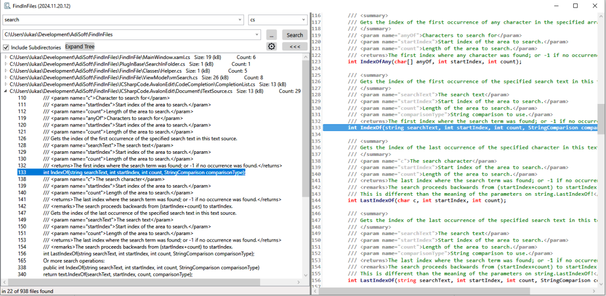
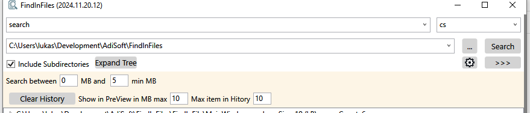

# About the Project

A small and fast tool to find a search term in text, pdf or Microsoft Office files. Created with Rider/Visual Studio and .NET 8

To avoid for example to open big files in the preview window or search just for a limited range of files I added some settings:

## Download

Just download the zip file and extract it somewhere. There is no setup file.

Download (latest version): [FindInFiles-2025.05.14.06.zip](https://github.com/lukas-adrian/FindInFiles/blob/master/FindInFiles-2025.05.14.06.zip)

## AvalonEdit as PreviewWindow

I am using AvalonEdit for my preview window, https://github.com/icsharpcode/AvalonEdit

## PlugIns Example

See: [FindInFiles.PlugIns](https://github.com/lukas-adrian/FindInFiles.PlugIns)

To create some plugin just reference PlugInBase and inherit from ISearchInFolderPlugIn.
You can use my plugIn SearchInTextFilesKMP as a template

      public Task<List<FileSearchEventArgs>> SearchInFolder(
         List<String> lstAllFiles,
         String searchTerm,
         bool matchCase,
         bool wholeWord,
         IProgress<Int32> progress,
         CancellationToken cancellationToken);

* path, is the folder path where you will search for the files
* extension, extension of the files. Just one extension because in the application is a loop for multiple extensions
* searchTerm, some text
* searchTerm, some search term
* matchCase, match case only
* progress, is for the waiting bar
* cancellationToken, for cancelling

## Ideas/ToDo's

* ~~(todo) add more PlugIns like PDF, Office Documents, etc~~
* (idea) export of the results (csv, txt, clipboard, etc. no ideas yet)
* (idea) treeview, add some columns for filesize and amount of results
* (idea) ~~Tabs~~ (I don't like that idea anymore)
* (todo) change the design like files in a different color, dark theme, etc
* (todo) add optional page number and not only row number for PDFs
* (todo) expand the tree is too slow if there are a lot of nodes
* (todo) searching in multiple folder
* (todo) PlugIns including PreViewWindow like TextFiles + TextPreViewWindow, PDF + PDF PreViewWindow

## License

This project is licensed under the MIT License. See the [LICENSE](LICENSE.md) file for more details.
